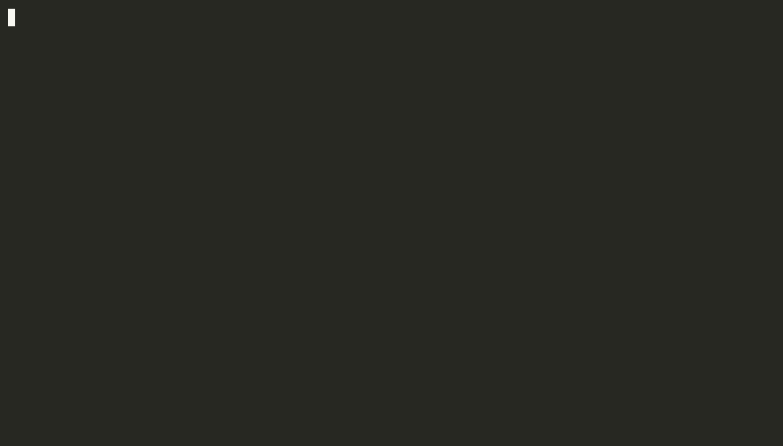

# Tyra

**A readable, statically-typed, Ruby-flavored compiled language.**
Compiles to native binaries via LLVM. No null, `Result`/`Option`, exhaustive pattern matching, and one unified toolchain.

[](LICENSE)
[](https://github.com/tyra-lang/tyra/actions/workflows/release-gate.yml)
[](docs/spec/en/language-spec.md)
[](https://tyra-lang.github.io/playground/?sample=showcase&run=1)

**[▶ Try Tyra in your browser](https://tyra-lang.github.io/playground/?sample=showcase&run=1)** — no install · [Website](https://tyra-lang.github.io) · [Getting started](docs/getting-started/README.md) · [Spec](docs/spec/en/language-spec.md)

```bash
curl -fsSL https://raw.githubusercontent.com/tyra-lang/tyra/main/scripts/install.sh | sh
# or: brew install tyra-lang/tap/tyra
```



```tyra
# A tiny pricing model in Tyra: algebraic data types, exhaustive
# matching, errors as values (Result), and no null anywhere.
type Plan =
  | Free
  | Pro(seats: Int)
  | Enterprise(seats: Int, discount: Int)

fn monthly_cost(plan: Plan) -> Result<Int, String>
  match plan
  when Free
    Ok(0)

  when Pro(seats)
    Ok(seats * 20)

  when Enterprise(seats, discount)
    if discount < 0 or discount > 100
      Err("discount #{discount}% is out of range")
    else
      Ok(((seats * 15) * (100 - discount)) / 100)
    end
  end
end

fn main() -> Unit
  let plans = [Plan.Free, Plan.Pro(seats: 5), Plan.Enterprise(seats: 50, discount: 20)]
  for plan in plans
    match monthly_cost(plan)
    when Ok(cost)
      println("$#{cost}/mo")

    when Err(msg)
      println("error: #{msg}")
    end
  end
end
```

```console
$ tyra build pricing.ty -o pricing && ./pricing
$0/mo
$100/mo
$600/mo
```

Tyra reads like Ruby and ships like Go — one toolchain, a single native binary (static builds on musl). Its design also makes code unusually predictable: given only the language spec and no prior training data, Claude writes correct Tyra on the **first try 88.7% of the time** (3 seeds × 100 prompts; [methodology](bench/ai-gen/METHODOLOGY.md)). The example above is runnable and CI-checked ([examples/launch/showcase.ty](examples/launch/showcase.ty)).

---

## What is Tyra?

Tyra is a general-purpose language designed from the ground up for an era where humans and LLMs collaborate on code. Every design decision prioritizes **interpretive consistency**: the same input should yield the same parse, the same type, the same meaning — for both humans and AI.

```tyra
import fs

import string

fn word_count(path: String) -> Result<Int, FsError>
  match fs.read_to_string(path)
  when Err(e)
    Err(e)

  when Ok(contents)
    let words = string.split_whitespace(contents)
    Ok(words.len())
  end
end

fn main() -> Unit
  match word_count("notes.txt")
  when Ok(n)
    print("#{n} words")

  when Err(_)
    print("error: could not read file")
  end
end
```

## Why another language?

Existing languages are optimized for humans alone. Tyra asks: *what would a language look like if it were designed for human-AI collaboration from day one?*

The answer is a language that:

- **Has no `null`, no truthy/falsy, no implicit conversions** — ambiguity is the enemy of both humans and LLMs
- **Requires explicit argument labels** at call sites, like Swift — so reading code never requires looking up the function definition
- **Distinguishes value types and reference types** at the language level — so memory semantics are visible, not inferred
- **Separates traits (replaceable behaviors) from abilities (structural properties)** — a novel design that prevents the trait/derive boilerplate of Rust
- **Uses `end` blocks, not braces** — so block boundaries are unambiguous in any visual context
- **Has one official toolchain**: `check`, `run`, `build`, `fmt`, `test`, `new`, and `mod` — all in a single CLI; no separate package manager to install

## Design influences

Tyra borrows selectively, not wholesale, from existing languages:

| From | What |
| --- | --- |
| Swift | Argument labels, value/reference distinction, `Optional` philosophy |
| Rust | `Result<T, E>`, `?` operator, ADTs with exhaustive `match`, traits |
| Ruby | `end` blocks, string interpolation `#{...}` |
| Go | Unified toolchain, GC, single-binary distribution |
| Kotlin | The data class spirit, applied to value types |

The combination, and especially the **trait/ability separation**, is original to Tyra.

## Hello, World

```tyra
fn main() -> Unit
  print("hello, tyra")
end
```

## A taste of the type system

```tyra
import fs

import string

# Algebraic data types with exhaustive pattern matching
type Payment =
  | Card(last4: String)
  | Bank(bank_name: String)
  | Cash

fn label(payment: Payment) -> String
  match payment
  when Card(last4)
    "card: #{last4}"

  when Bank(bank_name)
    "bank: #{bank_name}"

  when Cash
    "cash"
  end
end

# Errors as values, no exceptions
fn read_port() -> Result<Int, String>
  match fs.read_to_string("app.conf")
  when Err(_)
    Err("could not read app.conf")

  when Ok(contents)
    string.parse_int(contents).ok_or("invalid port number")
  end
end

# Value types with auto-derived equality
value Point
  x: Float
  y: Float
end

let p1 = Point(x: 1.0, y: 2.0)

let p2 = p1.copy(x: 3.0)
```

## New in v0.10.0 — Tuple types, SortedMap, SortedSet

**Tuple types** with full destructuring in `let`, `match`, and `for`:

```tyra-fragment
fn min_max(xs: List<Int>) -> (Int, Int)
  # ... returns a tuple
end

let (lo, hi) = min_max(values)   # let destructuring
```

**`SortedMap<K,V>` and `SortedSet<T>`** iterate in ascending key/element order. Key type must satisfy `Ord` (Float rejected at compile time — ADR-0002):

```tyra
import sorted_map

fn main() -> Unit
  let m: SortedMap<String, Int> = SortedMap.new()
  let m = m.insert("banana", 2)
  let m = m.insert("apple", 1)
  let m = m.insert("cherry", 3)
  for k, v in m
    print("#{k}: #{v}") # apple, banana, cherry — ascending order
  end
end
```

**`LinkedMap.from`** constructs from a tuple list:

```tyra
import linked_map

fn main() -> Unit
  let m = LinkedMap.from([("a", 1), ("b", 2), ("c", 3)])
  print("len=#{m.len()}") # 3
end
```

## Quick start: testing

Create a `*_test.ty` file and run `tyra test`:

```tyra
# math_test.ty
import assert

fn test_add() -> Result<Unit, String>
  assert.eq(1 + 1, 2)?
  Ok(())
end
```

```bash
tyra test                      # run all *_test.ty files in the current directory
tyra test src/                 # run a specific directory
tyra test --filter add         # run only tests whose name contains "add"
tyra test --list               # list test functions without running
tyra test --format junit       # emit JUnit XML (for CI test summaries)
```

See [docs/getting-started/08-testing.md](docs/getting-started/08-testing.md) for the full guide.

## What's new in v0.12.0

> **Correctness & safety** — `export fn main` is now rejected at compile time (E0111, spec §6.1); double-`.await`ing a `Task` handle is now a compile error (E0321, ADR-0030) instead of runtime undefined behavior, and a handle that's never awaited now warns (E0322); `json.parse` / `http.client.get` no longer leak their entire allocation on every call (GC-managed node trees replace the old `Box::leak`); the spec's scheduler and GC descriptions now match the reference implementation. [See known limitations](#known-limitations) before using in production. Full history: [CHANGELOG.md](CHANGELOG.md).

## Status

**Stable in v0.12.0** — supported and tested:

| Component | Notes |
| --- | --- |
| Language specification v0.11 | ✅ Complete |
| Lexer, Parser, Type checker | ✅ Complete |
| LLVM codegen + Boehm GC runtime | ✅ macOS arm64 / Linux x86_64 (glibc + musl) |
| Standard library (e.g. string, list, map, set, fs, io, json, assert, time, log, sorted_map, sorted_set, linked_map, http) | ✅ Complete |
| `tyra check / run / build` CLI (zero-arg project mode, `--release`) | ✅ Complete |
| `tyra build --static` — static single binary (musl) | ✅ Complete (v0.5.0+) |
| `tyra fmt [--check] [--stdin] <file\|dir>` — formatter + 100-col wrapping | ✅ Complete |
| `tyra test [--filter] [--list] [--format tap\|junit] [--timeout] [--jobs N]` | ✅ Complete |
| `tyra test --coverage` — line/function coverage reporting | ✅ Complete (v0.6.0+) |
| Per-test process isolation in `tyra test` | ✅ Complete (v0.5.0+) |
| Panic expectation (`test_panics_*` / `test "name" panics`) | ✅ Complete (v0.6.0+) |
| `test "name" [panics] <body> end` language syntax | ✅ Complete (v0.6.0+) |
| `continue` statement | ✅ Complete |
| `tyra new <name> [--lib] [--vcs none]` — project scaffolding | ✅ Complete |
| `tyra mod init/add/update/remove/show/tree/sync/clean [--locked]` | ✅ Complete |
| `tyra bench ai-gen` — AI generation benchmark runner | ✅ Complete |
| `tyra bench <dir>` — general-purpose wall-clock microbenchmark runner | ✅ Complete |
| Lambda / closures (spec §9.4, ADR 0011) | ✅ Complete |
| Generic `List<T>` + `map`/`filter`/`fold` | ✅ Complete |
| Generic `Map<K,V>` — HAMT-persistent, `insert`/`remove`/`get`/`contains_key`/iteration | ✅ Complete (v0.7.0+) |
| Generic `Set<T>` — HAMT-persistent, `insert`/`remove`/`contains`/iteration | ✅ Complete (v0.7.0+) |
| `for k, v in m` / `for v in s` — Map/Set iteration | ✅ Complete (v0.7.0+) |
| `LinkedMap<K,V>` / `LinkedSet<T>` — insertion-order persistent collections | ✅ Complete (v0.8.0+) |
| `LinkedMap.from([(k,v), ...])` — construct from tuple list | ✅ Complete (v0.10.0+) |
| Tuple types `(A, B)` — let/match/for destructuring (spec §11.5) | ✅ Complete (v0.10.0+) |
| `SortedMap<K,V>` / `SortedSet<T>` — key-sorted persistent collections (spec §11.3, §11.4) | ✅ Complete (v0.10.0+) |
| E0314 — compile-time diagnostic for non-displayable string interpolation | ✅ Complete (v0.10.0+) |
| Module-call type checking — E0318 unknown module fn, E0319 print displayable gate (ADR-0028) | ✅ Complete (v0.11.0+) |
| `Err`-returning main → stderr report + exit 1; `tyra run` propagates exit codes (ADR-0029) | ✅ Complete (v0.11.0+) |
| `tyra check/build --error-format json` — NDJSON diagnostics, stderr-pure on all paths (ADR-0026) | ✅ Complete (v0.11.0+) |
| USV character API (`string.chars`/`char_at`/`char_code`/`from_char_code`) + `list.sort`/`sort_str` (ADR-0027) | ✅ Complete (v0.11.0+) |
| E0308 diagnostic improvements — help hints, secondary labels, cascade dedup | ✅ Complete (v0.7.0+) |
| E0313 — for-loop binding count mismatch diagnostic | ✅ Complete (v0.7.0+) |
| Generic `assert.eq` / `assert.ne` (Int, String, Bool) | ✅ Complete |
| `string.replace` / `string.join` | ✅ Complete (v0.5.0+) |
| `Tyra.lock` + floating `branch` constraints + transitive dep resolution | ✅ Complete |
| LSP server (`tyra-lsp`) + VS Code extension | ✅ Development install |
| DAP debugger (DWARF + lldb-dap + VS Code breakpoints/locals) | ✅ Complete (v0.6.0+) |
| Static conformance corpus (42 positive programs + 25 error cases) | ✅ CI-gated |

## Platform support

> **Canonical reference.** This section is the single source of truth for platform and link-mode support. All other docs (AGENTS.md, release notes) refer here.

| Platform | Binary type | Status |
|----------|-------------|--------|
| Linux x86_64 (glibc) | Dynamic | Supported |
| Linux x86_64 (musl) | Static | Supported (v0.5.0+) |
| macOS arm64 | Dynamic | Supported |
| Windows x86_64 (MSVC) | Dynamic (`gc.dll` same-dir) | Experimental (v0.8.0+; tracking-only CI — see [Known limitations](#known-limitations)) |

**Using the musl static release artifact:**

The `tyra-*-linux-musl-x86_64-static.tar.gz` release includes a pre-built static `examples/hello` binary. To verify static linking works on your system:

```bash
tar xzf tyra-*-linux-musl-x86_64-static.tar.gz
cd tyra-*/
./examples/hello        # prints: hello, tyra
file examples/hello     # should say: statically linked
```

To compile your own static binary, use the musl-targeting `tyra` (i.e. run on Alpine Linux or equivalent musl toolchain):

```bash
tyra build --static myprogram.ty
```

**Experimental in v0.4.0** — included but not production-ready:

| Component | Notes |
| --- | --- |
| `http.server` stdlib | ⚠️ Basic GET/POST routing only; not production-ready |

**Backlog** — not yet implemented:

| Component | Notes |
| --- | --- |
| Registry (`tyra publish`), full registry-backed resolver | ⏳ Future |
| Homebrew tap (`tyra-lang/tap`) | ✅ v0.10.0+ |
| apt / other package managers | ⏳ Later |
| VS Code Marketplace publication | ⏳ Later |

## Known limitations

- **Windows is experimental**: Source-level MSVC ABI support exists (x86_64-pc-windows-msvc), and `tyra build` auto-copies `gc.dll` next to the output binary. The official LLVM Windows installer does **not** bundle the dev files required by `llvm-sys`, so `release-gate-windows` CI only `cargo check`s the LLVM-free crates (tracking-only, `continue-on-error: true`). To build the full compiler on Windows you need an LLVM 22 SDK with dev files installed locally. **Windows ARM64 and native PDB debug symbols are deferred** to a future release.
- ~~**`LinkedMap.remove` / `LinkedSet.remove` is O(n)**~~: resolved in v0.9.0 — tombstone model; key-absent remove is now O(1).
- ~~**HM unification is conservative**~~: resolved in v0.9.0 — substitution threading across the full checker pass.
- **`tyra build --static`**: only reliable on musl. glibc static linking is unsupported (breaks `getaddrinfo`).
- **`http.server`**: experimental. Single-threaded, no TLS, no middleware. Do not use in production.
- **Breaking changes**: expect breaking changes before v1.0.

## Documentation

- **[Getting Started](docs/getting-started/README.md)** — installation, hello world, testing, and project lifecycle
  - [Project Lifecycle](docs/getting-started/09-project-lifecycle.md) — `tyra new`, `tyra mod`, dependencies, builds
  - [Debugging](docs/getting-started/10-debugging.md) — DAP debugger, VS Code breakpoints, lldb-dap setup
- **[Language Specification (Japanese)](docs/spec/ja/language-spec.md)** — the authoritative source of truth
- **[Language Specification (English)](docs/spec/en/language-spec.md)** — translation, may lag behind
- **[Design Decisions](docs/design/)** — architecture decision records explaining *why*
- **[RFCs](docs/rfcs/)** — proposed changes for future versions
- **[Examples](examples/)** — runnable programs demonstrating stdlib features
  - [examples/11-stdlib-time-log.ty](examples/11-stdlib-time-log.ty) — `time.now_unix`, `time.monotonic_millis`, `log.info/warn/error`

## Goals

Tyra is designed for:

- Web backends and API servers
- CLI tools
- Internal business applications
- Small to medium-scale services

Tyra is **not** designed for:

- Operating systems or kernels
- Frontend (browser) development
- Embedded systems with extreme resource constraints
- Replacing Rust where its borrow checker is needed

## Non-goals

To keep the language small and predictable:

- No ownership or borrow checker (uses tracing GC)
- No macros or compile-time metaprogramming
- No runtime reflection
- No inheritance-based OOP
- No operator overloading
- No trait objects or dynamic dispatch
- No exceptions

See [spec §3 and §22](docs/spec/en/language-spec.md) for the full list (English translation; the [Japanese original](docs/spec/ja/language-spec.md) is authoritative).

## Installation

### curl | sh (Linux x86_64 and macOS Apple Silicon)

```bash
curl -fsSL https://raw.githubusercontent.com/tyra-lang/tyra/main/scripts/install.sh | sh
```

Installs to `~/.local/bin/tyra` by default. Supports `--prefix` and `--version` flags. See [docs/getting-started/01-installation.md](docs/getting-started/01-installation.md) for details.

### Homebrew (macOS)

```bash
brew install tyra-lang/tap/tyra
```

### Building from source

> Requires Rust 1.88+, LLVM 22, and Boehm GC (`bdw-gc`). (LLVM 21 also works — pass `--features llvm21-1`.)

Install prerequisites:

```bash
# macOS
brew install llvm@22 bdw-gc

# Debian / Ubuntu
sudo apt install llvm-22 clang-22 libgc-dev
```

Then build:

```bash
git clone https://github.com/tyra-lang/tyra.git
cd tyra
cargo build --release -p tyra-cli
```

The binary is at `target/release/tyra`.

Tyra's reference implementation links against Boehm GC for heap
reclamation (see [ADR-0007](docs/design/0007-boehm-gc-reference-impl.md)).

## Versioning

Tyra uses two parallel version streams:

- **Specification**: tagged as `spec-v0.1.0`, `spec-v0.2.0`, ...
- **Compiler**: tagged as `v0.1.0`, `v0.1.1`, ...

The compiler always declares which spec version it implements:

```console
$ tyra --version
tyra 0.12.0
implementing language spec 0.11
```

While Tyra is at v0.x, **breaking changes are allowed in MINOR version bumps**. After v1.0, breaking changes will use the Edition model (similar to Rust editions).

## Contributing

Tyra is at a stage where the most valuable contributions are:

1. **Reading the spec** and reporting ambiguities or contradictions as issues
2. **Writing example programs** that exercise edge cases (see `bench/static-corpus/`)
3. **Translating documentation** to English

Code contributions are welcome but the architecture is still solidifying. See [CONTRIBUTING.md](CONTRIBUTING.md) and [AGENTS.md](AGENTS.md).

## Philosophy

Tyra is a bet that the next decade of software will be written in collaboration between humans and LLMs, and that this collaboration deserves a language designed for it — not an existing language retrofitted with AI tooling.

This means accepting tradeoffs:

- We choose verbosity over inference when inference creates ambiguity
- We choose one way to do things over multiple equivalent ways
- We choose explicit annotation over clever shortcuts
- We choose a small, learnable language over a powerful, expressive one

If you've ever wished a language would just *behave predictably* — that the code you read would mean what it appears to mean, that an LLM's first guess would be correct — Tyra is built for you.

## License

Apache License 2.0. See [LICENSE](LICENSE).

## Acknowledgments

Tyra's design benefited from iterative review and discussion with AI assistants during specification development. Final design decisions and project direction remain the responsibility of the maintainer.

---

**English** | [日本語](README.ja.md)
